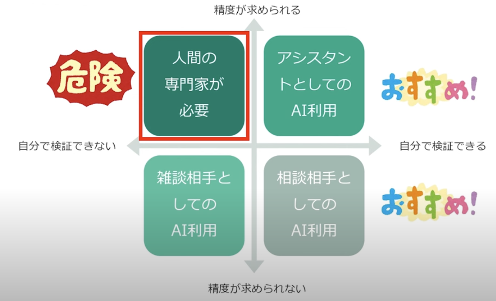

# AIの教育における影響について

## 参考文献
[【ChatGPTと学校教育①】ChatGPTの導入と教育における影響](https://www.youtube.com/watch?v=luDw0eCHkIk)

## 概要
特に重要なのは、ChatGPTの使用を判断する2つの基準です：

1.  出力結果を自分で検証できるか
2.  高い精度が必要か

この2つの基準に基づき、以下のように活用することを推奨しています：

✅ 推奨される使用法：

- アイデア出しの補助（ブレインストーミング）
- 検証可能な内容についての情報収集
- 学習のサポートツール（自己検証を前提に）

 

🚨 注意が必要な使用法：

- 検証が難しく高い精度が要求される場合
- 専門的な判断が必要な場合
→ これらは人間の専門家に相談すべき

また、教育面での具体的な課題として：

- 基礎学力の形成阻害の可能性
- 学生の実力評価の困難さ
- テストやレポートでの不適切な使用
が挙げられています。

講演者は、ChatGPTを「使うか使わないか」ではなく、「どのように適切に使うか」という観点で捉えることの重要性を強調しています。

 

## 🌟 これを読んで思ったこと
AIの使用を判断する基準である「出力結果を自分で検証できるか」が、プログラミング初学者には難しいのではないかと考えた。

👍 望ましい使い方
- わからない概念を簡単な言葉で説明してもらう
- エラーメッセージの意味を理解する

 

🚨 避けた方がいい使い方
- プログラムをまるごと書いてもらう
- エラーが出たらすぐAIに聞く
- 自分で考える前にAIに答えを求める
